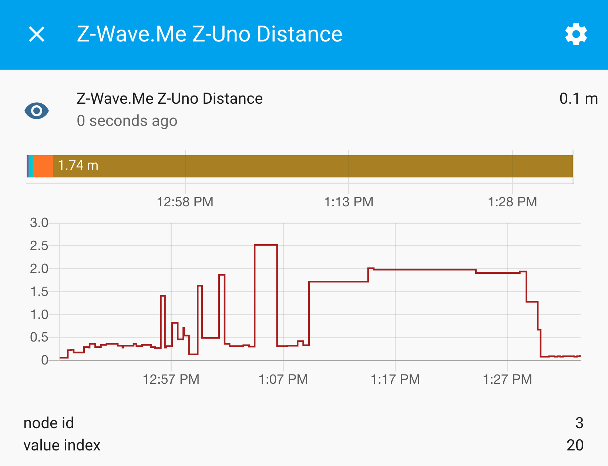

# Hack Day - Home Assistant/Zuno



## Prerequisites

### Vagrant

#### MacOS

https://www.vagrantup.com/downloads.html

```sh 
brew cask install vagrant
```

### VirtualBox

https://www.virtualbox.org/wiki/Downloads

#### MacOS 

```sh
brew cask install virtualbox
```

## Setup 

1. `./bin/setup`
1. `vagrant up`
1. `vagrant ssh`
1. `cd /vagrant`
1. `docker-compose up`
1. `open http://localhost:8123`
